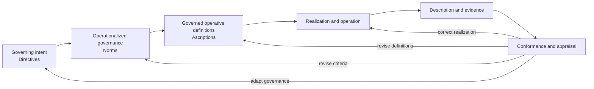

The familiar opposition between definition and description rests on a hidden assumption: descriptions record what a system is, while definitions declare what it must become. Framed this way, they appear to be competing foundations. Yet a procedure may describe current practice while defining required action. A code scan similarly describes a system whose code is itself an operative definition. Observation then reveals what those definitions realize under particular conditions.

The duality may not exist. Systemics already formalizes regulation as a closed loop in which action produces effects, observation feeds evidence back, and correction preserves viability. Poesis makes the definitional structure of that loop explicit and governable: **definition makes observation intelligible; description makes definition corrigible.**

That move turns a powerful way of understanding systems into a practical capability for governing how they evolve: the Generative System Model (GSM) makes definitions explicit, versioned, and evaluable, so the loop can be operated rather than merely drawn.

## Definitions can precede descriptions

A definition can exist before the thing it defines is realized or observed. A policy can precede compliant practice, a blueprint its construction, source code its execution, and a Directive the evidence of conformance to its intent.

Definition is generative: it establishes identity, form, behavior, or obligation from which realization may follow. In GSM, a Definition retains stable identity while successive Ascriptions state its governed, versioned content. Policies, contracts, procedures, blueprints, source code, and deployment manifests can all carry definitions in native form.

Description is required not for definition to exist, but to know what it realizes and whether the result remains conformant and viable.

> **Definition can precede description. Description cannot validate what has not yet been observed and defined.**

## A description is a view over a definition or its effects

A description is a view over a defined artifact, its realization, or its effects. A survey describes enacted practice; an operating report describes realized activity; code analysis describes an executable definition; an audit describes conformance outcomes. No view is the system itself, and none alone establishes purpose or authority.

This is why any claim to a single “source of truth” is useful but insufficient. A policy, procedure, model, or codebase may define part of what should happen; observation describes what is realized. Governing intent determines whether either is legitimate, purposeful, and viable.

## Can description exist without definition?

No. Description is directed by prior distinctions that determine what can be noticed, measured, and judged relevant.

A workforce survey depends on definitions of roles and participation. An environmental assessment depends on definitions of boundaries and indicators. A repository scan depends on definitions of dependencies and relationships. Appraisal depends on a Norm defining applicability and the assertion against which evidence is evaluated. Even raw signal capture is not yet description: it becomes description only when a frame determines what the signal is evidence of.

The observed subject need not already have an approved GSM Ascription: description can reveal what governance has not recognized. But without prior categories, criteria, and purpose there is no description, only occurrence.

> **No description without prior definition. Definition without description is both possible and, at inception, unavoidable.**

### The chicken and egg, ordered in time

The chicken-and-egg problem disappears when successive governance cycles are separated:

> **Current definition → realization → description → next definition**

Description may inform the **next** definition, but it never precedes definition as such. GSM makes this inherited definitional seed explicit, governed, and evolvable instead of leaving it hidden in the observer or instrument.

## Is a description itself a definition?

The entanglement invites the reciprocal question. The answer is no — not by virtue of being a description. The two perform distinct roles:

- a **definition** establishes identity, admissibility, intent, behavior, or evaluative criteria;
- a **description** asserts evidence about a definition, its realization, or its effects.

The same artifact can serve both. A policy review, strategic plan, or architecture document may describe the present while defining an intended future. A discovered account may inform a candidate Ascription and become definitional only after governance gives it that authority and function. Definition and description are distinct facets of one reflexive process, not independent opposites.

## Operative and governing definitions

**Operative definitions** make or constrain what a system can do. Roles allocate authority, procedures prescribe action, contracts establish obligations, budgets constrain choices, and code defines executable logic. These definitions may be precise without being aligned: a procedure or program can faithfully produce the wrong outcome.

**Governing definitions** express what operative definitions serve and when they remain acceptable. In GSM, Directives establish governing intent, Norms make it evaluable, and Ascriptions carry versioned definitions of governed subjects.

Directives and Norms do not replace local policies, procedures, models, or code; they qualify and constrain them. The resulting sequence is compact: **governing intent → evaluable criteria → operative definitions → realization → evidence → adaptation**.

## A failure is a conformance break, not a missing definition

Consider a procurement process that approves a supplier it should reject.

Its policies, procedures, decision rules, and supporting systems permitted the outcome; particular information and operating conditions realized it. The defect is not an absence of definition. It is a failure of conformance among governing intent, operative definitions, realization, or observation.

Several breaks are possible:

- the enacted procedure or supporting system does not conform to its approved definition;
- the approved definition or its Norms do not operationalize governing intent;
- local conditions prevent the operative definition from being faithfully realized;
- the evidence is misleading, or the governing intent itself is obsolete.

Calling all of these “drift between description and definition” loses the diagnosis. GSM's value is to make the relations explicit enough that the question becomes: **which conformance relation broke?**

The same applies to compliance. Written intent becomes governable only when Directives establish scope, Norms make it evaluable, and evidence can assess the affected Ascriptions. Compliance is a relation among intent, definitions, realization, and observation, not a property of documents. [Continuous regulatory compliance](/insights/continuous-regulatory-compliance/) develops that relation into a reusable, framework-independent model.

## What description uniquely contributes

Description contributes what definitions cannot produce alone: surprise. It can reveal unanticipated consequences, hidden relationships, or definitions that no longer preserve viability. It is the receptor surface of a reflexive system, capable of challenging every definitional layer.

But evidence cannot confer legitimacy. Description can falsify an expectation; governance determines what should replace it. This is why observation, judgment, and enforcement must sit in separate layers: a system that measures, judges, and enforces itself is not governed — an argument taken further in [The Poesis stack as a research system](/insights/poesis-stack-as-research-system/).

## Why Poesis is definition-centric

Definition-centric does not mean imposing one pristine model on reality. It gives definitions **definitional primacy**: they establish identity, obligation, deviation, and viability.

Poesis makes definitions stable in identity, typed across domains, versioned through Ascriptions, explicit in authority, and revisable through evidence. Description has evidential primacy: it determines what is happening and whether definition, realization, or governance must change.

The [generative inversion](/insights/the-generative-inversion/) is therefore a passage from **fragmented, weakly governed definitions** to **explicit definitions connected to evidence and capable of regulating their own evolution**. Authority is explicit, but never confused with infallibility. In an operating assistant the same distinction appears as the difference between asserted and observed context, examined in [Governed context or document retrieval](/insights/governed-context-versus-retrieval/).

## The synthesis: a closed definitional loop

In GSM, the relation becomes an explicit loop — Directives carry governing intent, Norms make it evaluable, and Ascriptions carry the versioned operative definitions:

The loop has an organizing center but no infallible artifact. Definition is the controlled variable; description is the evidence capable of challenging it. Poesis gives both a shared grammar: it makes definitions governable, connects them to intent and operation, then uses evidence to test and evolve them.

There is therefore no useful choice between definition and description. The distinction remains real, but the opposition dissolves: **description is how a definition-centric system becomes reflexive rather than dogmatic.**

That is also the foundation of the next article, [Better context beats bigger models: why Poesis matters for language models](/insights/why-poesis-matters-for-language-models/), which applies this loop to enterprise AI. A language model should not be asked to guess which of these layers an artifact represents, infer authority from prose, or silently convert observation into truth. It should contribute descriptions and candidate definitions inside a loop where their role, provenance, uncertainty, and conformance are explicit.
